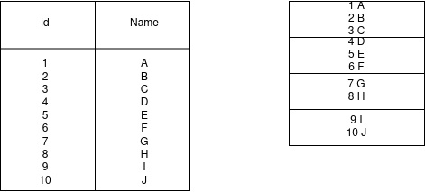
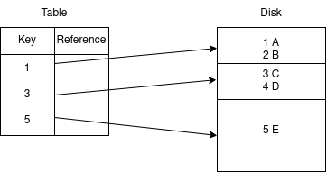
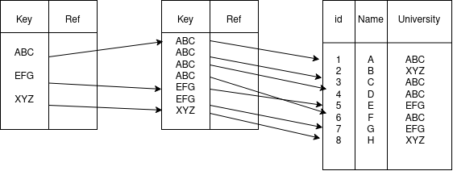
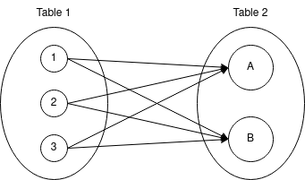

# Database Management Systems

## What is a Database and Database Management System

Data is information about different entities. Database is a collection of related data. For example, Scaler's database will have data about students, courses, mentors, instructors. Scaler's database will not have stock price data of indian stock market.

Database management systemm is a a way to store/manage/query data. Managing data means organizing, searching or deleting data.

### Types of Database Management Systems

Suppose we are given a list student at Scaler, how are we going to store that data? We could store them in Excel, files etc.

Storing data in files was one of the original database management systems. 

#### Files as a database

In Scaler, we can ave data about students, assignments, mentors, instructors. For every entity we can create files like students.txt, assignments.txt etc. Each line in the file is information about one student, one assignment, one mentor etc.
```
Students.txt
1.  Anil        2018   XYZ University    10     ABC_mentor   1234
2. Abhishek     2020   ABC University    99     XYZ-mentor   4321
```

**Cons**

Searching is inefficient because we read files in a sequential manner. We can have to go through every byte in file to search for the data that we want. This is because files are stored in HDD. Disk reads happen in sequential order.

Updating the file requires us to go the location, delete the data and then add the new data. This is inefficient as well.

Redundancy because we could store the same information in multiple files. This is inefficient use of space.

Due to redundancy, there could be inconsistency. When we update data in one file, we may forget to update the same data in another file. Now we have no way of knowing the correct information. 

Often files are stored as it is on disk. A DBMS encrypts data and then stores it. Thus security in this type of storage is also a problem.

Assume multiple people want to read information about students from the students.txt file. When we open a file, we get a pointer to the reading index. There is only one pointer per file. When one user is reading the file, the other users will have to wait.

In real systems, file based DBMS are used only if 

1. There are no updates.
2. File is small (500 characters). It does not take much time to read this sequentially.
3. There is low throughput. If there is only 1 request per second for example. 

File based database systems can be used for batch processing, or in situations where concurrency is not required. 

#### Dedicated DBMS

As we have seen, files, as a database system, are not a good choice. There are dedicated DBMS that have been created to provide features that overcome all the cons asociated using files as a database system. These features include 

1. concurrency
2. security
3. efficient access and storage
4. integrity (consistent data)
5. Views provide better access management. We can take a view of a elevant part of the data and share it with other stakeholders. This ensures that other parts of the data are not exposed, which means data is secure. Views also help in implementing role based access control (RBAC) which means depending on the role, some may have read-only access, other may have read-write access etc.

There are different types of dedicated DBMS. The first one and a popular one is relational DBMS.

**Relational DBMS**

Relational DBMS stores data as multiple tables that are related to each other. It stores one type of data in one table. In Scaler system, we can have a students' table, instructors' table, mentors' table, batches' table. In a batch table, we can store the strength of the batch, name of the batch, current instructor of a batch. We can have a user's table. 
```
Users
Name    |   email   |   phone_no:   |   password    |   grad_year   |   university


Batches
Name    |   current_instructor    |    start_date


Mentors
Name    |   email   |   current company    |    years of experience
```

The columns names are attributes of an entity.

These databases are also called SQL databases.

We access data in an SQL database row-by-row.

**NoSQL DBMS**

Databases that are not relational are called NoSQL databases. Some of the databases are graph based, columnar, time-based, document, key-value store. 
In columnar databases, we access the data column-by-column. Columnar databases are used when we want to perform analytics.

## Relational DBMS In-Depth

Relational databases use relational data model. Relational data model is a theoretical data model based on relational algebra. Relational algebra deals with sets and operations we can perform with sets. There are other models like tree (hierarchical), document etc. Relational data model says that every table is a set and when we run SQL queries we perform set algebra on the set.

### Relational Data Model

Relational data model is the widely used because it does not use complex data structures like trees or graphs. It uses set operations to manage large amounts of data. SQL uses these set operations to manage the data. In relational data model, we represent data as relations. Relations are nothing but tables of values. Every relation has multiple real instances, each represented as a row. 

### Terms of Relational data model

**Attributes**

Attributes are properties of relation or, in practical terms, columns of a table.

**Tuple**

Information of a single instance of a relation. We can also say that a tuple is a row of a table.

**Degree**

Number of attributes of a relation.

**Cardinality**

Number of tuples in a relation.

**Null**

Missing values in a tuple are represented by Null.

### Properties of a Relation/Table

1. Every row is unique. Atleast one column will be different. 
2. Every row should have the same datatype for corresponding columns.
3. Order of columns does not matter.
4. Order of rows does not matter. This also means we cannot expect our SQL queries to return data in any order unless we specify it.
5. Evert column name should be distinct.
6. Every value in a column should be atomic. Atomic values are single values. For example it can be integer, boolean, string or float. Lists, json, maps, objects are not allowed. This property exists because with collection data types, comparisons are difficult. Another reason is difficult in storing data that is a collection. Here each row is stored one after the other. RDMS is able to do this because we specify the max size of each column. If it is a string, we have to specify the varChar. In all other datatypes, the size of the value is known. Given this, RDMS can specify the size of each row and hence store data in rows on the disk. This makes it easy to access values in the database. It is difficult to get the size of data in a json or a list, using which the RDMS could have specified space for each row.

Many writes - NoSQL
Many joins - SQL
Many reads - SQL

### Keys

Keys are used to unqiuely identify a record/row. They are also used to identify relationships betweenn 2 sets. 

If a particular table does not have a column that is guarateed to be unique, then we will create our own identifier so that we can uniquely differentiate every record. 

#### Different types of keys

Consider a table of students. It has id, name, email, phone number, psp, streak, batch_id. 

**Super key** is a set of attributes that can uniquely identify a student.

For example, {id, name}, {name, email}, {id, name, email, phone number}, {complete attribute set} are all super keys. {id}, {email}, {phone number} are also super keys.

**Candidate key** is a subset of attributes where no 2 records will have the same value and the size of the subset is minimum. The size of the subset being minimum means if you remove any attribute from the set, then 2 records will have the same value.

For example {id, name} is a super key but not a candidate key because, even if you remove name, {id} is a super key. {email} is a super key and a candidate key. {complete attribute set} is a super key not a candidate key.

We can have multiple super keys and candidate keys. A super key always contains a candidate key

Case Study: We have a table to store information about mentor session of scaler students. Some columns of this table can be student_id, mentor_id, agenda, time, feedback. Is {student_id, mentor_id, time} a superkey? Yes. It is not a candidate key because if we remove student_id the remaining set is also a superkey. Is {mentor_id, time} a super key? Yes Is it a candidate key? Yes, because if we remove time, then the table will not have unique values of mentor_id. The same is the case with removing mentor_id as time cannot be unique for each session.

Can there be any 2 rows in my DB with the exact same value of all the attributes in key?
Yes - It is not a super key.
No - It is a super key.

If we remove any one attribute from the set, then can there be any 2 rows in my DB with the exact same value of the remaining attributes?
No - It is not a candidate key
Yes - It is a candidate key

**Primary key** is any one of the candidate keys. 

When we create a table, DBMS stores the data based on the value of the primary key. So we pick 1 among all the candidate keys as the primary key.

There can be only 1 primary key for a table. Primary key can have more than 1 attributes. It is better to choose an int/long vs string as the primary key. This is because comparisons are faster when we use use an int/long.

We should not use any of the attributes, that are part of the business logic, as primary keys. This is because in the future the values in that column could change or the business logic itself could change which means we will have to change the primary ket. This can make the DB operations inefficient. It is better to create a seperate attribute/column specifically for the primary key because there will, likely, not be any future change in the values of the column. 

**Composite key** is a key of >= 2 attributes. Composite key is a key where no single attribute can uniquely identify data. 

**Foreign key** is used to handle relations. It stores relations between 2 tables. For example batch_id in the students table.  It maps the students to the batches.

### Constraints

One of the properties that relational database management system offer is database constraints or checks. Just like a compiler tells you syntax errors, these checks tell us if there is a mistake when storing data.

**Domain Constraint**

Here, domain means datatype of column. This constraint checks if the datatype of the data we are inserting is the same as what was specified for the column.

**Entity Constraint**

Entity constraint checks if every column satisfies the constaint that has been specified for it. For example, this constraint checks if the primary key of an entry/entity is not NULL, if the columns that have to be non-null is non-null, if the row is unique with respect to the other rows etc.

**Referential Integrity Constraint**

Assume there is a students table and a batches table. 
```
Students
id      |       name        |       batch_id
1              Ashish                   2

Batches
id      |       name
1            Apr22Intermediate
2            May22Intermediate
3            May22Advanced
```
What will happend when we try to insert (2, Kiran, 4) into the students table?
This constraint stops us from inserting a record in a table, if the corresponding foreign key does not exist in the other table. 

Suppose we try to delete May22Intermediate from the batches table, the constraint will stop us from deleting this record. 
This constraint will not let us delete a row in the table being referred if there are still referring instances.

**Key Constraint**

Key contraint checks if the keys are unique values. This is similar to the entity constraint. Entity contraints are concerned with the availability of values and if available, if they are of the correct data type. Key constraints are primarily concerned with the different keys that exist like primary keys, composite keys and their uniqueness. 

### Schema

Schema is the blueprint of a database. Schema is going to contain all the tables that will be there in the DB. It will also contain the columns of every table. It also stores other properties related to a table like primary key, foreign key. Schema does not contain the data that will be in the database.

Let us look at what Scaler's DB schema will look like.
```
Users
id  |   Name    |   PhoneNumber    |    Email   |   GradYear    |    Univ   |   YOE

Students
id  |   Batch_id    |   psp     |   attendance  |   userid   |   streak

Batches
id      |       Name
```
Underline the primary keys. Use arcs connection the foreign key to the corresponding primary key.

### Operations

In any DBMS, we can perform four kinds of operations on any entity/table. These are create, read, update and delete (CRUD). In RDBMS, we can perform these operation on individual rows as well.

In SQL, create is done using the INSERT keyword, read is done using the SELECT keyword, update is done using the UPDATE keyword, delete is done using the DELETE keyword. We can perform these operations inside a table or on a table. When these operations are done on a table, then we use CREATE, SELECT (read the rows), ALTER (update constraints, add/remove/reame column), DROP. 

## Entity Relationships (ER) Model/Diagrams

Any data that we store in the database is either an entity or a relationship. Entities are anything for which we have to store information. Relationship is association between entities. 

**Case Study: Design ER diagram of Scaler**

Requirements/Use Cases

1. There are several batches at Scaler. Every batch will have id, name and current instuctor. 
2. Each batch will have multiple classes. Every class has id, name, instuctor.
3. Multiple batches can attend a class.
4. Every student has name, id, grad year, university, email, phone number.
5. Every student has a student buddy.
6. A student can move from one batch to another. For example when they pause a course. For every student, for every batch they were in, we need to store the batch entry date.
7. Every student has a mentor. Mentor has a name and YOE.

ER diagram

Entity is an object that causes behaviour in the system. It can be a real thing (student, instructor) or a concept (batch, assignment, class). We can identify entities in two ways.

1. Nouns - Nouns in the requirements.
2. Visualizaation

In this system, the entities are batch, instructor, class, student, mentor. Every entity has attributes. Entity is represented using rectangle with name inside the rectangle. 

There are multiple types of attributes in ER models.

Simple attributes cannot be divided further. They are atomic values. They are represented as ellipse shape with name inside it. These shapes are connected to the entity.

Composite attribtes have further parts. For example, address can be composed of house number, city and state. Composite attributes are not supported by relational models. Visualize a composite attriibute as a json with the sub-attributes as key. In a relational model a composite attribute will be a seperate table. If the relational model supports json, then we can have composite attributes as well. The parts of the composite attributes, if simple attributes, are represented the way simple attributes are represented and these simple attributes are connected to the composite attributes.

Multivalue attributes are data structures like lists or arrays where there are multiple values of the same thing. If a student has multiple mobile numbers, then we represent this attribute in the ER diagram using two concentric circles/ovals. 

Derived attributes can be found from other attributes. It is represented using dotted oval. 

Keys are something that uniquely identifies a record. In ER diagrams, keys are represented by underlying the ovals that are part of the key. In case of composite keys, we replace the attributes with a single oval called key/id and the attributes that together compose a key is represented as attributes that are part of this key/id.

Relationships is a connection between two entities. It is represented as a diamond between the two entities. We put the name of the relationship in the diamond. Cardinality of a relationship is determined by counting the number of records in the entities on the left side and by counting the number of records in the entities on the right side. There are 4 types of cardinality. These are 1:1, 1:m, m:1, m:m. Lets take a couple of examples from Scaler. To find the cardinality between students and batches, we can say 1 student can belong to 1 batch, but 1 batch will have multiple students. So the relationship is m:1. The cardinality between students and contest is m:m. One student can take part in multiple contests and a contest can have multiple students. 

If the relation is 1:1, we can put the attribute of the relationship in any of the table. If there is a table of husbands and there is a table of wives, then we store the date of marriage in any table.

If the relation is 1:m or m:1, then we have to put the attribute of the 1 side in the entity of the m side. 

If the relation is m:m, then we have to create a seperate table with one attribute each from both sides. We can also store an attribute representing the relationship of the two entities in the new table. We should represent the attribute in an ER diagram by connecting the attribute to the relationship diamond.

## Normalization and Functional Dependencies

### Anomalies

Issues that can arise due to bad database design. The root cause of all the issues that come up in database design is redundancy. Redundancy is one information repeated at multiple places. This means issues in database design can also be repeated at multiple places. Lets us look at different types of anomalies.

1. **Insertion anomaly**

Insertion anomaly is the inability to insert a row due to bad schema design. This is usually because of many NULL values under certain columns. 

For example, suppose we have a students table that has been designed like this
```
Students
id   |    Name    |     email    |    batch_id    |     batch_name
```
If we want to initialize a new batch without a student name or email, then we get
```
Students
id   |    Name    |     email    |    batch_id    |     batch_name
NULL      NULL          NULL           1                Apr22
```
There are 2 issues with this. First is primary key will not take NULL value. Second is waste of storage space due to many NULL values.

2. **Deletion anomaly**

Deletion anomaly is the loss of information related to specific attributes due to deletion of a row of a badly design table.

Taking the same example as above,
```
Students
id   |    Name    |     email    |    batch_id    |     batch_name
1         ABC          ABC@XYZ           1                Apr22
2         BCD          BCD@XYZ           2                May22
3         CDE          CDE@XYZ           1                Apr22
```
If student BCD leaves the program, then we delete the corresponding row from the table. But now, we lose the batch_id and batch_name information associated with the student. 

3. **Update anomaly**

Due to redundancy, when updating values of an attribute, we have to update at all the locations where the value is present. If the update process is interrupted, we will be left with inconsistent data in the database.

Taking the same example as above,
```
Students
id   |    Name    |     email    |    batch_id    |     batch_name
1         ABC          ABC@XYZ           1                Apr22
2         BCD          BCD@XYZ           2                May22
3         CDE          CDE@XYZ           1                Apr22
4         DEF          DEF@XYZ           1                Apr22
```
If we want to update Apr22 to Apr22Intermediate, then we have to update all the locations with Apr22. If the update process is interrupted before we update the entry for 'DEF', then 'ABC' and 'CDE' will have updated values, but not 'DEF'. If Apr22 was not repeated at all the locations, we would not face this risk. 

The solution to these anomalies is normalization. Normalization is a guide on how to design a database such that redundancy is minimized and as a result anomalies are minimized as well. Before we understand normalization, let us understand functional dependency. 

### Functional Dependency

Functional dependency between two attributes is represented by X ---> Y. Translated to english, this says value of Y can be derived from X or X derives Y or Y is derived by X.

If X ---> Y, then given value of X attribute, we will get a single value of Y.

Assume we have a table called students.
```
Students.
id   |    Name    |     email    |    batch_id    |     batch_name
```
Here, the functional dependencies are id ---> Name, id ---> email, batch_id ---> batch_name, email ---> id (email is unique), email ---> Name, id ---> batch_id, batch_name ---> batch_id. Name ---> email cannot be a functional dependency because there can be same names with different email ids. Batch_name ---> email cannot be a functional dependency because there can be many students that are part of the same batch.

Since there is a functional dependency between id and all other attributes, id can be made a primmary key.

Functional dependency helps us determine candidate key. A primary key is just one of the candidate keys.

### Normalization

Normalizaation is a process of removing redundancy from a database design and making DB design better. A caveat is that redundancy is necessary in cases where we want to do joins between tables, shard the database for scaling it.

In theory there are 1NF, 2NF, 3NF, 4NF, 5NF, 6NF and BCNF. BCNF is at the same level as 3NF. In practice, any normal form after 3NF is not used. Restrictions, in terms of what to include and what not to include in the database, become tighter as we move down the normal forms.

#### 1NF

1NF stands for first normal form. It says there should be no multi valued attributes. 
For example, consider a students table.
```
id      |       Name        |       Phone Numbers
1               ABC                [123, 345, 567]
```
This table is in violation of the first normal form.

There are a few ways to normalize it. 

First way is to seperate the values in the list to its columns. This is a valid solution if there is an upper limit on the number of values in the list.

Cons of this approach
a. Waste of space
b. Queries will be difficult because we will have to include all the columns.

Second way is to add multiple rows for each value in the list.
```
id      |       Name        |       Phone Number
1               ABC                    123
1               ABC                    345
1               ABC                    567
```
Now the primary key of this table will become id and phone number. There is waste of space because the name is repeating multiple times. This can also result in update anomaly.

Third way is to have a seperate table.
```
Students
id      |       Name

Phone Numbers
student_id      |       Phone Number
```
The primary key in the phone numbers table is student_id, phone number combined.

#### 2NF

The schema must be in first normal form. There should be no partial dependency. Partial dependency means an attribute can be derived from a subset of the primary key attributes.

Suppose our primary key is made up of 2 attributes A and B. If there exists another attribute D that can be derived from A alone, then this design is in violation of second normal form.

The solution is to seperate it into two tables.

For example, consider a students table.
```
Students
id      |       Batch_id        |       Batch_Name      |       psp
```
Assume that a student can be part of multiple batches. In this table, both id and batch_id togther make the primary key. We can get the batch_name using just batch_id. This is violation of the second normal form.

So we divide this table into two tables.
```
Students
id      |       Batch_id        |       psp

Batches
id      |       Name
```

#### 3NF

Schema should be in second normal form. There should be no transitive dependencies.

Transitive dependency means if A ---> B and B ---> C then A ---> C.

For all the functional dependencies that are there in a table:

a) Either the left side (X) should be a candidate key.
b) Or right side (Y) should be a part of the candidate key. 

Consider a students table with the following columns.
```
Students
id      |       Name        |       Batch_id        |       Batch_Name      |       psp
```
Assume that one student can belong to only one batch. Here, id is the primary key. There is functional dependence between batch_id and batch_name even though batch_id or batch_name are not candidate keys. We can also see the transitive dependency where id ---> Batch_id and Batch_id ---> Batch_Name and id ---> Batch_Name.

To normalize, we have to break up the students table to a students table and batches table.
```
Students
id      |       Name        |       Batch_id

Batches
id      |       Name
```

#### BCNF

Schema should be in third normal form. For any functional dependency X ---> Y, X has to be primary key.

Consider a students table with the following columns.
```
Students
id      |       Name        |       Phone Number        |       Batch_id
```
Here there is a functional dependency Phone Number ---> Name and phone number is not the primary key. To normalize we have to break up the table.
```
Students
id      |       Name        |       Batch_id

Phone Numbers
Student_id      |       Phone Number
```

## Transactions

Transactions are a set of logically linked operations which should all be done together.

When we deposit money in our account, we have to perform the following steps

1. Read the current balance.
2. New balance = current balance + money deposited.
3. Update account with new balance.

Suppose a bank customer A wants to transfer X to another bank customer B.

1. Deduct from A's account.
a. old = current balance of A.
b. new = old - X.
c. Store new balance in A.

2. Increment in B's account.
a. old = current balance of B.
b. new = old + X.
c. Store new balance in B.

If we do 1, but we are not able to 2, then the money will be lost. Both steps 1 and 2 should be done together. 

### Properties of a transaction

Why do we need the group of transactions to be run together?

The answer is ACID properties. Relational databases help us stick to ACID.

What is ACID?

A - Atomicity.
C - Consistency
I - Isolation
D - Durability

An atomic operation is a single operation that will either happen or not happen. In case of a transaction, we either want the complete transaction to be executed or none at all. If a transction is paused in between, previous steps done till then will need to be undone. 

Consistency means that the overall system before and after a transaction should be in a consistent state.

Isolation means neither the external world can affect you, nor can you affect the external world. If two transactions are running together, then their intermediary results should not be visible to each other. If two transactions T1 and T2 are running in parallel, if the intermediary results of T1 is visible to T2 and T2 performs some operations based on it, then if T1 rolls back, the database will be left in an inconsistent state.

If multiple transactions are running in the system at the same time, they should be isolated from each other. Consider the following scenario
```
            A transfers 500 to B                   |            B wins 1 cr               
1. Read balance of A, old = 10000.               
2. new = old - 500 = 9500.
3. Update balance of A.
4. Read balance of B, old = 0.                               Read balance of B, old = 0.
5. new = old + 500.                                          new = old + 1 cr
6.                                                           update balance o B = 1 cr.
7. Update balance of B = 500
```
After the transactions above, the balance of B = 500 instead of 1 cr. This is because the two transaction were running at the same time. We need concurrecy control to prevent this from happening. The solution is to take a DB lock over the rows being updated and release the lock only when updation happens. 

Durability means the effect of a transaction should be persisted. The result of a transaction should be saved and should be recoverable under all circumstances. 

### How a Transaction is Executed

There are three commands that make a transaction successful. 

1. **ABORT**

ABORT command stops a transaction. For example, if A wants to transfer 10000 to B and A does not have 10000 rupees, then we want to stop the transaction. When we abort the transaction, the changes made till then, which are in the memory, will not be visible anymore and we will exit the transaction. 

2. **ROLLBACK**

When we ABORT a transaction, we need to undo the changes in the memory and go back to the last committed state. We do this using the ROLLBACK command.

3. **COMMIT**

When a transaction is complete, the DBMS runs the COMMIT command. The results of a transaction are visible only after COMMIT is executed. 


**Procedure**
Procedue is like a function. Rather than running a set of operations one-by-one from the appServer, the procedure will run the operations for us.

Procedures lead to tight coupling between business logic and data layer. Business logic should ideally rely on appServer whereas the database should only be the data layer.

Running procedure across shards in a distributed system has problems. 

Why are procedures not preferred by engineers in general?
The ability of having a version control mechanism and ownership mechanism. When you make a commit, there will be a code review, testing in a staging environment, then deploy will be deployment in a particular deployment cycle etc. With business logic in the appServer, we have control to do A/B testing. We cannot do these things with stored procedures.

### How to design a DB that supports Isolation

One option is to lock the complete database. If we process 1 query at a time, this will ensure isolation. The con with this approach is that latency will increase. 

Second option is to lock the related rows of a table. Lock on a row means that a row can be accessed only by a single user at a time. Every other transaction waits. This is a better solution than the first option.

When should we take a lock? If we want to read a record in the database, we do not need to take a lock. This means we should consider a transaction as a set of read anad write queies. 

When running 2 or more transactions, we should not allow any other transaction to read an attribute where an uncommitted write was made. The same transaction where the write was made is allowed to read the value. This is concurrency control.

When we send an SQL query, it goes to an executor. The executor makes a plan. In the plan it fetches the rows on which the query has to be executed and then it executes. In the executor, we can take a lock over the rows that have to be selected.

Lock over rows is also taken when running a FOR UPDATE SQL query. This is used in bookmyshow. When we book seats in bookmyshow, the appServer checks if the seats are available. If they are available, the appServer runs a FOR UPDATE command over the rows. This locks the row for update. This means others can read from it, but they cannot update it. Then payment service runs. If payment is successful, the rows are updated. If payment is unsuccessful, the rows are released and they are available for booking again. These queries are not a transaction. This was just an example of how isolation works when the queries are not a transaction.

Whether transactions/single queries, a DB manager will have some queries in it. Each query will be in a thread and sent to an executor/query manager. The executor/query manager tells us the rows on which we have to take locks. Once transaction/query executes, the lock will be released. 

## Indexing

Indexes are used to make data access fast. In database management systems, data is stored in the disk. Inside the disk data is stored in blocks. When a query is sent to the DBMS, the query executor fetches data from the RAM. To answer any query, data will have to be fetched to RAM from the disk. This is called I/O operation. Accessing data from the disk is slow. 

Assume a disk in which records are stored in blocks. Consider a students table with id and name as columns. The way this table is stored in the disk is shown in the image.



Suppose we ran a query to update the name of the student whose id is 7.
```
UPDATE Students Name = Hello WHERE id = 7
```
As the Students table is stored in the disk and assuming there are no indexes, we will have to sequentially fetch blocks and load it to RAM from the disk and check if the id in it is 7. If not we move to the next block until we find the relevant block. Once we find the relevant block, we update the relevant field and save the block in the disk. 

We sequentially performed I/O operation with each block till we found the relevant block. This is time consuming and inefficient. 

An improvement we can do is to maintain a table which stores the id range and the reference address of the blocks in the disk that store the data within that range, this will speed up the process and increase efficiency as we wont have to sequentially pull blocks of data to the RAM. We can use the table to perform binary search and find the reference address of the block that contains the relevant data and only pull that block to RAM.

The benefit of indexing is reducing I/O operations from disk to RAM.

There are three types of indexes

1. Primary
2. Clustered
3. Secondary

There are indexes based on two parameters.

1. Ordered and unordered paramaters
2. Unique or non-unique

If index has ordered and unique values, then index is called primary index.

If we have non unique values and they are ordered, then we have clustered index.

If we have unordered values, then irrespective of the the uniqueness or non-uniqueness of the values, we have secondary index.

Consider a students table with id and name as columns.
```
Students
id      |       Name
1               A
2               B
3               C
4               D
5               E
```
When index is created on the primary key, which in this case is the id, it will be a primary key because the id column is sorted and it is unique.

By default, data in the database is stored in a sorted order of the key. The index table and the data in the disk will look like its shown in the image.



We dont need to have all the id values as key in the index table. We can have an index table with the starting value of the id in the block. This is possible because the id values are sorted in the HDD. An index where we dont have an entry for every row is called a sparse index. Primary index is a sparse index. Size of a sparse index will always be smaller than the table it is indexing.

If the values of a column are sorted but non-unique, then it creates a clustered index. Consider a table and an index like this.


In this case, Bivek points to the first instance of Bivek in the HDD. When we run a query like 
```
UPDATE marks += 30 WHERE name = Bivek
```
then we first find the first Bivek's reference address and update the marks, then keep moving down as long as a flag column in the same table says that this is not the last Bivek in the table.

Clustered index is also a sparse index. 

Everytime we write to a table, the index needs to be updated. Given this, greater the number of indexes, slower the writes and faster the reads. 

If the value of a column are not sorted and nor are they unique, then the index will be a secondary index. 



In the above image, we want to make an index on the university column. However, the column is neither ordered nor unique. To make an index table, we make an index table where the key column contains the university names in sorted order and the values pointing to the corresponding locations on the HDD which contains the correponding records. This is a dense table. We have another sparse table that contains the university name as key and its value pointing to the first occurence of the university name in the dense table. 

Seocndary index table helps us to fetch the relevant blocks and to ignore the irrelevant blocks. So they help us reduce the number of I/O operations while searching for data.

Internally index tables are stored as B+ trees. In JAVA, hash map is unordered and tree map is ordered. In C++, there is unordered map and map. Both tree map and map store the keys using balanced binary search trees. This is how they are able to return the keys in sorted order. B tree is a type of balanced binary search tree.

An unordered map or hash map of the values of the column to the corresponding address of their location in the HDD does not provide an advantage when we run queries to get data in a range.
```
SELECT * FROM Students WHERE psp>70 AND psp<90;
```
Here we will need an index made out of values in the psp column. The values and their corresponding reference address should be stored in a tree like structure to make this query fast. This is because tree type data structures provide ordered keys which is essential to make search faster in certain type of queries. 

**Properties of B trees**

1. In a BBST, all the leaf nodes are left aligned. In a B tree all the leaf nodes are on the last level. 

2. B tree has a value called t. In one node, there will be upto t values. If a node has t values, every node can have t+1 children.

For example, given t = 4, and values 1, 2, 3, 4, 5, 6, 7, 8, 9 a B tree will look like this image.


Why do we have mutiple keys at each node? How does it make search efficient? The answer lies in the fact that index is also stored in disk. When we fetch from disk, we get a block at a time. So the size of a node is the size of a block in the HDD, which means t is determined by the size of the disk block. With one disk access, we get pull many rows at the same time. The search operation is also faster than in a binary tree where there are only 2 children per node.

B tree is a balance search tree, not a balanced binary search tree. We can perform an inorder traversal of the tree to get the keys in the sorted order. 

Inside each value/key of a node, we store the key (values of the column) and the pointer to its location in the disk.

Index is also stored in a disk because of a couple of reasons.

1. We could run out of space in RAM. 
2. We want to persist the index. This is because creating the index each time we reboot is an expensive operation, O(nlogn).

When should we not use index?

1. Writes are slower. When there is an insertion or updation, we have to change the index as well.
2. Index will also occuoy space in the disk.

When should we create indexes?

1. We should not create indexes when creating the table. 
2. Create indexes when we want to make queries quicker. 

Should we create indexes on string columns?

We should never indexes on complete string column. If the maximum length of the values in the column is 100 and we create an index on the complete string column, then this is ineffcient. Instead we should check the number of unique values for each size of the prefix of the values of the column. The prefix size for which a subsequent increase in prefix size does not add any new value of the columns should be the size of the prefix for which we should create the index.

## SQL

### Basics

SQL stands fo structured query language. This language is used to work with RDBMS. In RDBMS, data is stored in a structured manner. There are tables, columns, datatypes of each column etc. 

SQL is used to do operations with the database. These are operations like querying data, modifying data, making database efficient etc. 

SQL is not a case sensitive language. However, there are conventions. We use upper case for keywords. We use lower case for names od tables/columns/databases. 

If an SQL file has multiple lines or commands, terminate each with a semi-colon (;).

A line that starts with '--' is a comment.

Line breaks are not important in SQL.

Strings can be represented by single or double quotes. 

### CRUD on Data

#### Creating a Row

Consider a database called sql_store with a table called customers. The table has columns customer_id, first_name, last_name, birth_date, phone, address, city, state, points. There are two ways to insert a row into a table when we have to specify the database the table is in.
```
INSERT INTO sql_store.customers 
VALUES 
(13, "Nemo", "Hero", "2017-08-25", "123456", "Robin's address", "Gotham", "US", 1000); 

USE sql_store;
INSERT INTO sql_store.customers 
VALUES 
(12, "Tintu", "Kundi", "1900-01-01", "0000", "Joker's address", "Gotham", "US", 0);
```

The first column here is the id. In the above example we have specified the value. However, if the id is auto-incrementing, we can run INSERT queries without specifying the id.
```
INSERT INTO sql_store.customers 
VALUES 
(DEFAULT, "Nemo", "Hero", "2017-08-25", "123456", "Robin's address", "Gotham", "US", 1000); 

USE sql_store;
INSERT INTO sql_store.customers 
VALUES 
(NULL, "Tintu", "Kundi", "1900-01-01", "0000", "Joker's address", "Gotham", "US", 0);
```

We can also specify the column names while running the query. The column names can be in any order. The values have to be in the same order as that of the column names, if specified. 
```
INSERT INTO sql_store.customers (customer_id, first_name, last_name, birth_date, phone, address, city, state, points)
VALUES 
(13, "Nemo", "Hero", "2017-08-25", "123456", "Robin's address", "Gotham", "US", 1000);
```
The advantage of specifying columns is that we can skip columns that are NULLABLE or can auto generate values. 

We can insert multiple rows into the table at the same time. 

#### Reading a Row

To read from a table, command that is used is SELECT. Let us look at the syntax structure of the SELECT command. 
```
SELECT [column_names]
FROM [table_name]
WHERE [conditions]
ORDERBY [column_name];
```

To select all the columns from a table we run the following SELECT command.
```
SELECT *
FROM [table_name];
```

We can also run mathematical expression on the column in the query.
```
SELECT points + 100
FROM sql_store.customers;
```

To select distinct values of a column, we use the keyword DISTINCT.
```
SELECT DISTINCT first_name
FROM customers;
```

When using WHERE, we can do comparison conditions. 
```
less than --> <
greater than --> >
less than or equal to --> <=
greater than or equal to --> >=
equal to --> =
not equal to --> != or <>
```

String comparison in SQL is not case-sensitive. 

We can also compare dates. 

```
SELECT *
FROM customers
WHERE first_name = "Nemo";

SELECT *
FROM customers
WHERE
(NOT birth_date >= "1990-01-01)
AND (points >= 1000);
```

Consider a query where the condition is that the value can be any of 3 values of a column.
```
SELECT *
FROM customers
WHERE
state = 'MA'
or state = 'IN'
or state = 'IL';

SELECT *
FROM customers
WHERE
state in ("IN", "IL", "MA");
```

If we want to select rows based on values of a column lying in a range (1000, 3000).
```
SELECT *
FROM customers
WHERE
points BETWEEN 1000 and 3000;
```
This will fetch rows that have points = 1000 and 3000. This is because BETWEEN is inclusive. So the query we need to run is as follows.
```
SELECT *
FROM customers
WHERE
points BETWEEN 1001 and 2999;
```

Sometimes, while string matching, we want to select those that have some specific characters, but it does not need to exactly match. This is where we use the keyword LIKE.
```
SELECT * 
FROM customers
WHERE address LIKE "%l%";
```
Here, we want to find those records where the address contains the letter 'l'.
```
% --> >= 0 characters
%b --> the string ends with 'b'
%b% --> the string contains 'b'
%b%a% --> the string contains 'b' followed by 'a'
_ --> exactly 1 character.
%l_ --> the second character of the string is 'l'
```

To find those records where the value of a partiular column is NULL.
```
SELECT *
FROM customers
WHERE phone IS NULL;
```

By default, the output of a read query is ordered by primary key. If we want to specify the column by which the output is ordered, we should use the keyword ORDER BY.
```
SELECT *
FROM customers
WHERE
phone IS NOT NULL
AND points > 1000
ORDER BY state;
```
If two records have the same state, then by default the two records will be ordered by the customer id. If we want to change the nature of ordering, we can use the keyword DESC.
```
SELECT *
FROM customers
WHERE
phone IS NOT NULL
AND points > 1000
ORDER BY state, customer_id DESC;
```

We can specify the number of records in the output using the keyword LIMIT.
```
SELECT *
FROM customers
WHERE phone IS NOT NULL
AND points > 1000
ORDER BY state DESC
LIMIT 2;
```

#### Updating a Row

Let us look at the syntax structure of the UPDATE command.
```
UPDATE [table_name]
SET column = "new value"
WHERE [condition];
```

#### Deleting a Row

Let us look at the syntax structure of the DELETE command.
```
DELETE FROM [table_name]
WHERE [condition];
```
If we do not specify a condition, then everything in the table will be deleted.

#### REGEXP

### JOINS

We merge 2 tables using the keyword JOIN. JOIN by default is inner join. 

Along with the customers table, we also have an orders table with columns order_id, customer_id, order_date, status, comments, shipped_date, shipper_id.

We cannot get a table with columns order_id, first_name, last_name, order_date from any one table. We have to join the customers and orders table to get these columns in the output table. 

How do we join the two tables? We join in using orders.customer_id = customers.id.

First let us get all the columns of the two tables together. 
```
SELECT *
FROM orders
JOIN customers
ON order.customer_id = customers.customer_id;
```

To get the columns that we want, we have to run the following query.
```
SELECT order_id, orders.customer_id, first_name, last_name, order_date
FROM orders
JOIN customers
ON orders.customer_id = customers.customer_id;
```
When a column name is present in both tables, we have to specify the table from which to get the values of the column. In this case, the table is orders and we should specify orders.customer_id.

We can give the tables aliases using the following syntax.
```
SELECT order_id, od.customer_id, first_name, last_name, order_date
FROM orders od
JOIN customers cs
ON od.customer_id = cs.customer_id;
```
We can join across databases. In inner join, we dont need the columns on which we merge the tables to have a primary key, foreign key relationship. The values of the two columns need to match for the merge to take place. 

**How does inner join work?**

There are two tables orders and customers. For each row in orders, it will check all the rows in the customers. When the attributes we are joining on match, it creates a final output.

#### Inner Joins

Consider a students and batches table.
```
Students
id  |   Name    |   gender  |   batch_id
1       Naman       M           1
2       Alok        M           1
3       Sameer      M           NULL

Batches
id  |   Name    |   Count_of_classes
1      Aug21Int         100
2      Nov21Int         120
```
We want to create an output table with columns Name and Batch_name. 
```
SELECT st.Name, btch.Name
FROM Students st
JOIN Batches btch
ON st.batch_id = btch.id;
```
The following is the algorithm of inner join.
```
for every row1 in table1:
    for every row2 in table2:
        if row1.batch_id = row2.id:
            ADD NEW ROW IN JOIN
```

If any attribute, used after the ON keyword, in the two tables is NULL, then that record will not be in the record.

Consider 3 tables students, batches and teachers.
```
students
id  |   name    |   batch_id

batches
id  |   name    |   teacher_id

teachers
id  |   name
```
We want a table with student name and corresponding teacher name. To get this table, we have to first join students and batches on batch_id and then the resultant table has to be joined with teachers table to get the teachers name.
```
SELECT s.name, t.name
FROM students s
JOIN batches b
ON s.batch_id = b.id
JOIN teachers t
ON b.teacher_id = t.id;
```
The intermediate table will have the columns students_id, students_name, batch_id, batch_name, batch_teachers_id.

We can match on multiple conditions.
```
SELECT s.name, t.name
FROM students s
JOIN batches b
ON s.batch_id = b.id
AND s.name = 'Naman'
JOIN teachers t
ON b.teacher_id = t.id;
```

#### Outer Joins

Outer joins are of two types, left outer join and right outer join.

##### Left

In RDBMS, tables are analogous to sets. When we perform an inner join of two tables based on an attribute, we are selecting the intersection of two tables.

In case of a left outer join, we are selecting the entire left table whether it has rows intersecting with the right table or not.

Consider the earlier students and batches table.
```
Students
id  |   Name    |   gender  |   batch_id
1       Naman       M           1
2       Alok        M           1
3       Sameer      M           NULL

Batches
id  |   Name    |   Count_of_classes
1      Aug21Int         100
2      Nov21Int         120
```
We want an output table with all the student's names in it. This cannot be done using inner join. 

To get the output table, we have to run a query with left outer join.
```
SELECT s.name, b.name
FROM students s
LEFT OUTER JOIN batches b
ON s.batch_id = b.id
```

##### Right

In case of a right outer join, we are selecting the entire right table whether it has rows intersecting with the left table or not.

Consider the earlier students and batches table.
```
Students
id  |   Name    |   gender  |   batch_id
1       Naman       M           1
2       Alok        M           1
3       Sameer      M           NULL

Batches
id  |   Name    |   Count_of_classes
1      Aug21Int         100
2      Nov21Int         120
```
We want an output table with all the batches in it.

To get the output table, we have to run a query with right outer join.
```
SELECT s.name, b.name
FROM students s
RIGHT OUTER JOIN batches b
ON s.batch_id = b.id
```

#### Full Joins

Full joins output a table that has the rows of both left and right table. The keyword used here is FULL JOIN.

#### Cross Joins



```
SELECT *
FROM students
CROSS JOIN batches;
```

```
SELECT *
FROM students, batches;
```

```
SELECT *
FROM students s, batches b
WHERE s.batch_id = b.id;
```

#### Self

Consider an employees table in a database called sql_hr. The columns in the employees table are employee_id, first_name, last_name, job_title, salary, reports_to, office_id. The reports_to column will have the employee_id of the employee's boss.

We want an output in a table with columns employee_id, employee_name and manager_name. To get this output, we need to merge employees table with the employees table itself.
```
SELECT emp.employee_id, emp.first_name, mgr.first_name
FROM sql_hr.employees emp
JOIN sql_hr.employees mgr
ON emp.reports_to = mgr.employee_id;
```
We need alias for the tables in case of self join, else it will not be possibe to differentiate between the two tables.

Behind the scenes, a copy of the table is created.

#### USING Clause

These days, it is good practice to keep the names of the columns in a table specific.
```
students
student_id  |   student_name    |   gender  |   batch_id
1       Naman       M           1
2       Alok        M           1
3       Sameer      M           NULL

batches
batch_id  |   batch_name    |   count_of_classes
    1          Aug21Int         100
    2          Nov21Int         120
```
Now we can run a query to join with USING clause.
```
SELECT *
FROM students s
join batches b
USING (batch_id);
```
We can put multiple columns in USING.

#### Natural Joins

We can join two tables on the same column name using NATURAL JOIN.
```
SELECT *
FROM students
NATURAL JOIN batches;
```
#### Implicit Joins

### Aggregate Queries

Sometimes we are not interested in getting particular rows, but instead we are interested in getting a summary of data. These can be getting the max(), min(), avg(), sum(), count(). These functions are called aggregate functions. 

For example, consider a students table with the columns id, name, amount, psp.
```
students
id  | name  |   amount  |   psp
```
To get the max psp in a batch, we run a query using the aggregate function.
```
SELECT Max(psp)
FROM students;
```

Aggregate functions ignore NULL values. 

To get the count of students in scaler, we can use the aggregate function count()
```
SELECT count(id)
FROM students;
```
```
SELECT count(*)
FROM students;
```
We cannot run the count function on amount column, because aggregate functions ignore NULL values, and amount column may have NULL value.

**Grouping of Rows**

Consider a students table with columns id, batch_id and amount_paid.
```
students
id  |   batch_id    |   amount_paid
1          1                100
2          1                200
3          2                150
4          1                200
5          3                100
```
We want a table showing the total amount paid batch-wise.
```
batch_id    |   total_paid
    1              500
    2              150    
    3              100
```

To get this data, we need to group by the batch_id.
```
SELECT batch_id, sum(amount_paid)
FROM students
GROUP BY batch_id;
## Indexing
```
In the query, we can only include columns that are part of the group. In the above example, we cannot include the id in the columns to output because each batch_id has one row, but some batch_ids have more than one rows, which is not possible to include in one row. 

When using group by in a query, the table in split into multiple tables of each value of the column the data is grouped on. 

Consider a table called persons which contain duplicate emails. We want to get the duplicate emails.
```
SELECT p.email
FROM persons p
GROUP BY p.email
HAVING count(p.email) > 1;

SELECT p.email
FROM persons p
GROUP BY p.email
HAVING count(*) > 1;
```
Both these queries work. The second query also works because it is counting the number of rows in each table of distinct emails. The table of emails with duplicate values will have greater than 1 row. 

**Grouping multiple columns**

Suppose we have a class_ratings table with columns batch_id, instrutor_id, class_id and average_rating.
```
class_ratings
batch_id    |   instructor_id   |   class_id    |   average_rating
```
We want the average rating of each instructor for each batch. 
```
batch_id    |   instructor_id   |   average_rating
```
The query for this will be to group by multiple columns.
```
SELECT batch_id, instructor_id, avg(average_rating)
FROM class_ratings
GROUP BY batch_id, instructor_id;
```

**HAVING Clause**

Say we want to get a table of instructors that have an average rating < 4.
```
SELECT batch_id, instructor_id, avg(average_rating) as avc
FROM class_ratings
GROUP BY batch_id, instructor_id
HAVING avc < 4;
```
We cannot use the WHERE clause in a query with GROUP BY. We can use WHERE clause before GROUP BY, but not after.

### Subqueries

Subquery is a query within a query.

Consider two tables students and universities.
```
Students
id  |   name    |   university_name

universities
id  |   name    |   percentage
```
We want a list of students who are in universities with percentage > 80.
```
SELECT *
FROM students
where university_name in (
    SELECT name
    FROM universities
    WHERE percentage > 80
);
```

Consider two tables students and instructors.
```
students
id  |   name    |   instructors_id

instructors
id  |   years_of_experience
```
We want to get students who are being taught by instrutors with greater than 4 years of experience.
```
SELECT *
FROM students
WHERE instuctors_id in (
    SELECT id
    FROM instructors
    WHERE years_of_experience > 4
);
```

If subquery returns a single value, then we can use equal to '=' symbol.

Consider a table of students with columns id, name, university_id and psp. 
```
students
id  |   name    |   university_id     |    psp
1         A               31                87
2         B               1                 90
3         C               2                 83
4         D               31                88
```
We want students whose psp > the all the psps of students who have university_id = 31.
```
SELECT *
FROM students
WHERE psp > ALL (
    SELECT max(psp)
    FROM students
    GROUP BY university_id
    HAVING university_id = 31
);

SELECT *
FROM students
WHERE psp > ALL (
    SELECT psp
    FROM students
    WHERE university_id = 31
);
```

We use ALL when there is a comparison operator like >, <, >=, <=, !=.

Like ALL, there is also ANY keyword. 
```
SELECT *
FROM students
WHERE psp > ANY (
    SELECT psp
    FROM students
    WHERE university_id = 31
);
```
Given a list of psps, we just need the psp to have a value greater than any of the values in the list.

#### Correlated Subsqueries

Consider a students table with columns id, name, psp, batch_id.
```
students
id  |   name    |   psp     |   batch_id
```
We want to get students whose psp is greater than the average psp of their batch.
```
SELECT *
FROM students s
WHERE psp > (
    SELECT avg(psp)
    FROM students e
    GROUP BY e.batch_id
    HAVING e.batch_id = s.batch_id
);
```

## Query Optimization